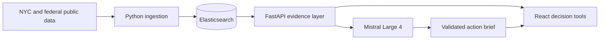

# Carbon Copy NYC

**An evidence-backed climate policy copilot for New York City.**

Carbon Copy turns public climate data into decisions a mayor, council member, building owner, or advocate can understand and act on. It combines Elasticsearch retrieval and ranking with Mistral Large 4 brief generation, while keeping observed facts, modeled scenarios, and assumptions visibly separate.

The result is not another generic climate chatbot. Every number shown to the model comes from a bounded evidence packet, and every interactive scenario exposes its assumptions.

## What you can do

### Ask Mistral for an action brief

Choose an audience and ask a plain-English policy question. Mistral Large 4 returns a direct recommendation, concrete action plan, measurable success criteria, limitations, and evidence identifiers. Generated numbers are validated against the retrieved evidence before a brief is returned.

### Model electric-bus operating costs

Move diesel and electricity price sliders to see annual energy spending change immediately. The model uses reported FY2024 diesel-bus travel as a shared baseline and clearly excludes vehicle purchases, charging infrastructure, depot construction, financing, maintenance, batteries, and demand charges.

Ask **“What would change your mind?”** and Mistral selects the most relevant assumption to challenge. Python then calculates the diesel-price floor, electricity-price ceiling, bus-efficiency ceiling, and a break-even sensitivity curve. This makes the recommendation falsifiable instead of presenting a single favorable scenario.

### Prioritize the next 100 trees

Change the relative importance of heat vulnerability, vegetation deficit, and limited household air-conditioning access. Elasticsearch reranks NYC neighborhoods and reallocates a fixed 100-tree planning pool after every adjustment.

The controls also accept natural language. Mistral converts a planner's request into normalized, explicit weights; Elasticsearch reruns the ranking; and the interface marks which neighborhoods moved up, moved down, or newly entered the priority list.

### Find a building's greener twin

Search 14,281 NYC multifamily disclosures by building name, address, or ZIP code. Carbon Copy finds comparable properties by use, reporting year, size, and construction year, then shows the peer median, benchmark gap, and three lower-emissions comparables.

### Explore NYC climate evidence

The Evidence view also surfaces measured flooding, future flood exposure, constructed green infrastructure, neighborhood air quality, and heat indicators.

## Why Elasticsearch and Mistral

| Technology | Role in Carbon Copy |
|---|---|
| **Elasticsearch** | Building autocomplete, fuzzy address search, structured peer filters, medians, neighborhood script scoring, ranking, and climate-signal retrieval. |
| **Mistral Large 4** | Converts bounded evidence into audience-specific policy recommendations and structured action briefs. |
| **Deterministic Python** | Calculates costs, emissions gaps, peer comparisons, allocations, and model validation. Mistral does not invent these numbers. |
| **React + FastAPI** | Provides the interactive interface and a thin API over the existing analysis modules. |

## How the two core technologies work together

### Elasticsearch: retrieval, comparison, and transparent ranking

The application uses Elasticsearch as its analytical retrieval layer—not simply as document storage.

**Building search and greener twins**

1. NYC disclosure records are normalized and indexed with text, keyword, numeric, and geo fields.
2. Autocomplete searches `property_name`, `address`, `postal_code`, and a combined `search_text` field using boosted multi-field matching and fuzzy spelling tolerance.
3. After a user selects a building, a bool query filters candidates to the same property type and reporting year, then applies floor-area and construction-year ranges.
4. If a building is unusual, Carbon Copy widens those ranges in documented stages rather than silently returning unrelated peers.
5. Numeric sorting and peer aggregation identify lower-emissions examples and the comparable-building median.

**Tree allocation**

The heat tool sends the user's three policy weights into an Elasticsearch `script_score` query. The script normalizes heat vulnerability, vegetation deficit, and household A/C deficit, calculates a visible priority score, and returns a new ranking. Python then distributes exactly 100 planning trees in proportion to those scores.

**Climate evidence retrieval**

Flood observations, future flood exposure, green-infrastructure status, and neighborhood air-quality signals are indexed as queryable evidence. The API retrieves bounded top results and summary counts for the dashboard and Mistral evidence packet.

### Mistral Large 4: reasoning over verified evidence

Mistral is the policy-reasoning layer. It receives the user's question, intended audience, and a compact dictionary assembled from Elasticsearch results and deterministic calculations.

The prompt requires a structured response containing:

- a decision-focused headline;
- a direct recommendation;
- sequenced actions with an accountable city actor;
- measurable success checks;
- limitations;
- the identifiers of evidence actually used.

The API requests JSON structured output and validates it with Pydantic. It then compares every numeric token in the generated answer with the supplied evidence. If Mistral introduces an unsupported number, the answer is rejected instead of displayed.

This division of responsibility is intentional:

```text
Elasticsearch finds and ranks evidence
        ↓
Python calculates reproducible scenarios
        ↓
Mistral chooses the decision-relevant story and actions
        ↓
Python validates the generated claims
        ↓
React presents the brief with its evidence and limitations
```

Elasticsearch therefore determines *what is true in the retrieved data*; Mistral determines *how to explain it and what decision it supports*. Neither component can be removed without changing the product.



## Data sources

- [NYC Building Energy and Water Data Disclosure](https://data.cityofnewyork.us/Environment/NYC-Building-Energy-and-Water-Data-Disclosure-for-/5zyy-y8am/about_data)
- [NYC Heat Vulnerability Index](https://a816-dohbesp.nyc.gov/IndicatorPublic/key-topics/climatehealth/hvi/)
- [FloodNet NYC](https://www.floodnet.nyc/)
- [NYC Department of Environmental Protection green infrastructure](https://data.cityofnewyork.us/Environment/DEP-Green-Infrastructure/)
- [NYC Environment and Health Data Portal air quality](https://a816-dohbesp.nyc.gov/IndicatorPublic/)
- [National Transit Database](https://www.transit.dot.gov/ntd)
- [U.S. Energy Information Administration](https://www.eia.gov/opendata/)
- [U.S. Environmental Protection Agency emissions factors](https://www.epa.gov/climateleadership/ghg-emission-factors-hub)

## Quick start

### Prerequisites

- Python 3.11+
- Node.js 20+
- An Elasticsearch deployment
- A Mistral API key with access to `mistral-large-4`
- An ElevenLabs API key (optional, for report narration)

### 1. Configure the environment

```bash
cp .env.example .env
```

Fill in the required values:

```dotenv
ELASTIC_ENDPOINT=https://your-elasticsearch-endpoint
ELASTIC_API_KEY=your-elasticsearch-api-key
MISTRAL_API_KEY=your-mistral-api-key
MISTRAL_MODEL=mistral-large-4
ELEVENLABS_API_KEY=your-elevenlabs-api-key
ELEVENLABS_VOICE_ID=JBFqnCBsd6RMkjVDRZzb
ELEVENLABS_MODEL=eleven_multilingual_v2
```

Never commit `.env`. It is excluded by `.gitignore`.

### 2. Install and index the data

```bash
python3 -m venv .venv
source .venv/bin/activate
pip install -r requirements.txt
python setup_carbon_copy.py
```

### 3. Start the API

```bash
source .venv/bin/activate
uvicorn api:app --reload --port 8000
```

### 4. Start the React interface

In another terminal:

```bash
cd frontend
npm install
npm run dev
```

Open [http://localhost:5173](http://localhost:5173).

### Optional: original Evidence Lab

```bash
source .venv/bin/activate
streamlit run app.py
```

Open [http://localhost:8501](http://localhost:8501).

## API overview

| Endpoint | Purpose |
|---|---|
| `GET /api/health` | Service and Mistral-model status |
| `GET /api/overview` | Evidence-page metrics and chart data |
| `POST /api/brief` | Evidence-bounded Mistral action brief |
| `POST /api/speech` | ElevenLabs MP3 narration for the generated brief |
| `GET /api/trees` | Weighted Elasticsearch neighborhood ranking |
| `POST /api/trees/interpret` | Mistral natural-language weights plus before/after Elastic ranking |
| `POST /api/bus/stress-test` | Mistral-selected assumption with deterministic break-even curves |
| `GET /api/buildings/search` | Building autocomplete and fuzzy search |
| `GET /api/buildings/{property_id}/peers` | Comparable-building benchmark |

Interactive API documentation is available at [http://localhost:8000/docs](http://localhost:8000/docs) while FastAPI is running.

## Methodology and guardrails

### Building benchmark

The initial peer group uses the same property type and report year, floor area within 25%, and construction year within 15 years. For unusual buildings, the bounds widen transparently until at least three peers are available.

```text
benchmark gap =
  (building intensity - peer median intensity)
  × building floor area
  ÷ 1,000
```

This is a descriptive benchmark, not a retrofit forecast, engineering recommendation, or legal Local Law 97 determination.

### Bus scenario

The operating comparison applies user-selected energy prices to a common FY2024 travel baseline. Operational emissions use published fuel and grid factors. Capital and ownership costs are intentionally excluded and named in the interface.

### Tree priority model

Elasticsearch normalizes the Heat Vulnerability Index, vegetation deficit, and household A/C-access deficit before applying user-controlled relative weights. The result identifies neighborhoods for planning—not individual planting sites.

### AI grounding

Mistral receives a compact evidence dictionary rather than unrestricted application state. Generated numeric claims must match the supplied evidence or the API rejects the response.

## Project structure

```text
.
├── api.py                    # FastAPI endpoints
├── app.py                    # Original Streamlit Evidence Lab
├── carbon_copy.py            # Building search and peer analysis
├── bus_scenario.py           # Fleet cost and emissions model
├── climate_signals.py        # Flood, infrastructure, and air-quality data
├── executive_briefing.py     # Mistral action-brief orchestration
├── heat_priority.py          # Weighted neighborhood ranking
├── setup_carbon_copy.py      # Elasticsearch setup and ingestion
├── frontend/
│   └── src/                  # React interface and styles
└── requirements.txt
```

## Three-minute demo

1. Open **Evidence** and move the diesel-price slider to show budget exposure.
2. Change the tree-priority weights and watch the neighborhood ranking update.
3. Search for **432 Park Avenue** and open its greener-twin comparison.
4. Return to **Ask Mistral** and generate a Mayor / City Hall action brief.
5. Point out the evidence IDs, measurable actions, and explicit limitations.

## Development checks

```bash
python -m py_compile api.py carbon_copy.py bus_scenario.py climate_signals.py executive_briefing.py heat_priority.py
cd frontend && npm run build
```

## License

This project is available under the [MIT License](LICENSE). Public datasets remain subject to their respective publishers' terms and attribution requirements.

---

Built for the Elastic × Mistral NYC Hack Night.
